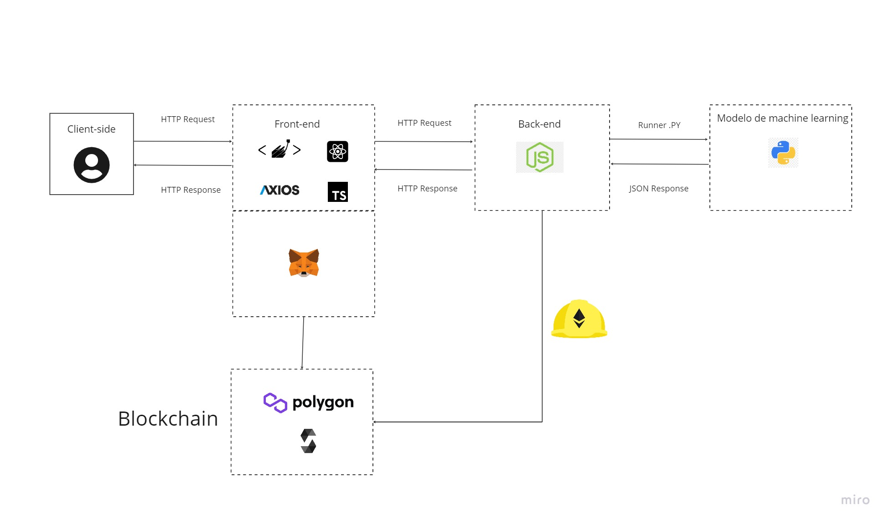
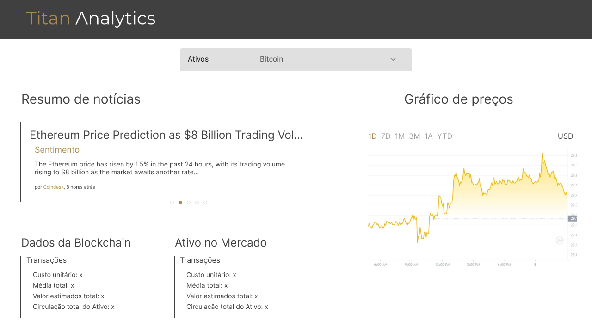
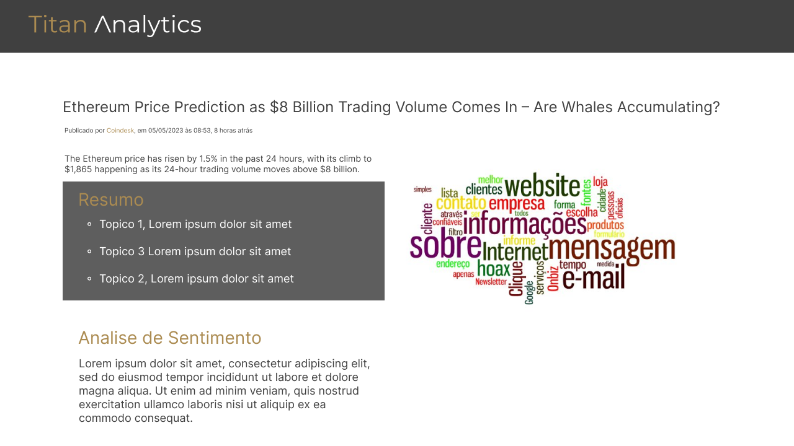

# **Titan Analytics - Challenge Inteli Blockchain 2023**

**Nome da solução:**

_Titan Analytics_

**Data de criação:**

06 de maio de 2023

# **Link para acessar remotamente**
https://main--venerable-strudel-31a994.netlify.app/

# **Sumário**

# **Overview do Projeto**

## Árvore de arquivos (placeholder)

As pastas desse projeto foram organizadas conforme exemplo a seguir:

```
├── .vscode
├── Backend
│    ├── smart-contract
│    ├── database
│    ├── prisma
│    ├── src
│    ├── utils
├── Documents
├── IA
│    ├── (arquivos da ia)
├── Frontend
│    ├── .next
│    ├── assets
│    ├── components
│    ├── pages
│    ├── public
│    ├── styles
├── README.md
```
Os códigos que mais se adequam a categoria da Titanium Asset estão localizados dentro da pasta 'IA', que contém todos os scripts utilizados para coleta dos dados e para a geração dos insights (resumo, análise de sentimento...) a partir desses.

Os códigos que mais se adequam a categoria da Mynt estão localizados dentro da pasta 'backend/smart-contract", que implementam o smart contract para a utilização do BTG Dol.

## 1. Descrição da Solução

A _“Titan Analytics”_ é uma plataforma que utiliza inteligência artificial para fornecer informações precisas e atualizadas aos analistas da Titanium Asset Management e público interessado em crypto ativos, orientando suas decisões de investimento em criptomoedas. Por meio da coleta de dados de diversas fontes online, com a junção de análise dos mesmos em tempo real, o sistema gera relatórios detalhados e confiáveis que ajudam os usúarios a identificar oportunidades de investimento e tendências de mercado de forma ágil e embasada. Com essa solução, a _“Titan Analytics”_ tem à disposição um conjunto de informações valiosas para ajudar a tomar decisões de investimento mais assertivas.

---

## **Elaboração do Sistema**

## 2.1 Arquitetura do Sistema



## 2.2 Tecnologias Utilizadas

Tecnologias utilizadas no desenvolvimento da aplicação:

- React
- CSS
- Typescript
- Node Js
- Python
- Hardhat
- Solidity

## 2.3 Protótipo da solução

 Para iniciar o processo de desenvolvimento da nossa solução, utilizamos o Figma para criar protótipos das telas e definir o fluxo de uso da ferramenta.

### Landing Page

### Research HUB

É nela que disponibilizamos para nosso usuário as principais informações que ele necessita para uma avaliação do ativo



### Notícias Detalhadas

Ao clicar em determinada notícia no _Research Hub_, nosso usuário encontra essa **pagina**(?) com as informações detalhadas da notícia, um resumo, o sentimento geral, além de uma _nuvem de palavras_



## 2.4 Por trás dos algoritmos 
Os modelos de inteligência artificial utilizados para o desenvolvimento da aplicação são :
- gpt 3.5 para a sumarização dos textos.
- text-davinci-003 para a análise de sentimento das notícias.
Ambos os modelos foram desenvolvidos pela OpenAI.

Além desses modelos, o sistema faz o uso de diversas técnicas e ferramentas de processamento de linguagem natural, como por exemplo o Bag Of Words e WordCloud (nuvem de palavras). O uso dessas ferramentas foi facilitado principalmente por meio da biblioteca python nltk.
Para o consumo dos dados, os seguintes recursos foram utilizados:
- api google news, para coleta das notícias sobre determinado criptoativo
- api binance, para análise do preço do ativo nos últimos 7 dias
- api coingecko, para coleta da cotação do ativo em diferentes exchanges

Por fim, desenvolvemos a API utilizando o Flask e hospedamos em uma nuvem gratuita (Render), permitindo que o modelo seja acessado por qualquer serviço.


Para melhor entendimento do código, todos os métodos utilizados foram documentados no próprio código.

## 2.5 Implementações futuras

Nosso projeto não foi pensado exclusivamente para o hackathon, mas sim feito para o mercado, portanto, está pronto para receber novas implementações, como:

### 2.5.1 Implementações para melhoria do modelo:
 - Assinatura da API privada do Google News.
 - Assinatura da API privada do Twitter.
 - ChatGPT Plus.
 - Utilizar APIs que geram insights,sobre dados técnicos das redes BlockChain, para acompanhar o número de transações da moeda em tais redes, como a Token Terminal.
 - Transcrição de áudio para texto, para resumir vídeos e lives relacionada ao ativo pesquisado.

É fundamental destacar que todas essas melhorias teriam um impacto significativo na qualidade e na velocidade dos dados utilizados pelo modelo de inteligência artificial.
### 2.5.2 Outras implementações:
- Possibilitar arbitragem dentro do sistema.
- Implementar histórico de relatórios por usuário, ou seja, recomendar na homepage as moedas mais pesquisadas pelo usuário.

# **3\. Rodando a aplicação**

**Para rodar a solução no ambiente de desenvolvimento siga os seguintes passos :**

Instale o python na versão 3.10.11 a partir do seguinte \[link\](https://www.python.org/downloads/release/python-31011/)

Clone o projeto

\`\`\`bash

git clone https://link-to-project

\`\`\`

Na sua IDE de preferência abrir o repositório e criar um arquivo .venv

Tendo certeza que o python 3.10.11 é o interpretador da venv abra o terminal na IDE

Vá para a pasta do modelo

\`\`\`bash

cd IA

\`\`\`

Instale as dependências

\`\`\`bash

pip install -r requirements.txt

\`\`\`

apos isso volte para a pasta principal e entre na pasta 'frontend'

\`\`\`bash

npm install --force

\`\`\`

apos isso rode o comando

\`\`\`

npm run dev

\`\`\`

Pronto, o projeto já pode ser alterado e pode ser acessado localmente

## Licença (Placeholder)

Distributed under the MIT License. See `LICENSE` for more information.

## Colaboradores

<table><tbody><tr><td><a href="https://www.linkedin.com/in/allan-casado-6339a9177/"></a><br><a href="https://www.linkedin.com/in/allan-casado-6339a9177/"><strong><sub>Allan Casado</sub></strong><sub>&nbsp;</sub></a></td><td><a href="https://www.linkedin.com/in/eduardo-franca-porto/"></a><br><a href="https://www.linkedin.com/in/eduardo-franca-porto/"><strong><sub>Eduardo Porto</sub></strong><sub>&nbsp;</sub></a></td><td><a href="https://www.linkedin.com/in/felipe-saadi/"></a><br><a href="https://www.linkedin.com/in/felipe-saadi/"><strong><sub>Felipe Saadi</sub></strong><sub>&nbsp;</sub></a></td><td><a href="https://www.linkedin.com/in/joão-lucas-gonzalez/"></a><br><a href="https://www.linkedin.com/in/joão-lucas-gonzalez/"><strong><sub>João Lucas Gonzalez</sub></strong><sub>&nbsp;</sub></a></td><td><a href="https://www.linkedin.com/in/mihaellalves/"></a><br><a href="https://www.linkedin.com/in/mihaellalves/"><strong><sub>Mihaell Alves</sub></strong><sub>&nbsp;</sub></a></td><td><a href="https://www.linkedin.com/in/pedro-gattai-096678227/"></a><br><a href="https://www.linkedin.com/in/pedro-gattai-096678227/"><strong><sub>Pedro Gattai</sub></strong><sub>&nbsp;</sub></a></td></tr></tbody></table>
