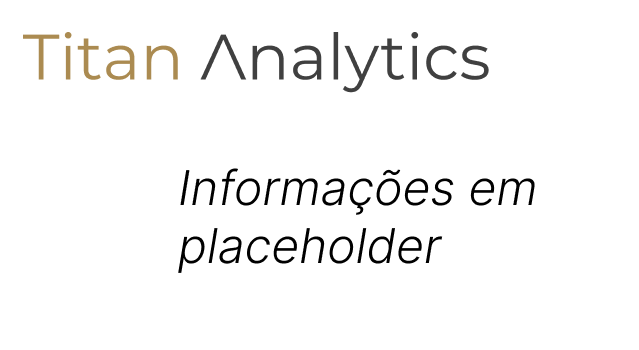

# Titan Analytics - Challenge Inteli Blockchain 2023




## Nossa Solução

## Documentação

A documentação com informações da visão geral do projeto, análise de negócio, requisitos do sistema e elaboração do sistema pode poder ser encontrada clicando [aqui](https://docs.google.com/document/d/1tVFvokeI9kHdzBjVO3KQHdwHLsf30SQoNz_Xy_5rL6w/edit?usp=sharing)

## Árvore de arquivos

As pastas desse projeto foram organizadas conforme exemplo a seguir:

```
├── .vscode
├── Backend
│    ├── database
│    ├── hardhat
│    ├── prisma
│    ├── src
│    ├── utils
├── Documents
├── Frontend
│    ├── .next
│    ├── assets
│    ├── components
│    ├── pages
│    ├── public
│    ├── styles
├── README.md
```

## Arquitetura do sistema


## Tecnologias

Esse projeto foi desenvolvido usando as seguintes tecnologias:


---

## Rodando a aplicação

Para rodar a aplicação há algumas dependências que precisam ser instaladas devido às tecnologias utilizadas, são elas:

-   Node Js


### Rodando a blockchain e deployando os contratos


### Rodando o backend


### Rodando o frontend

Para rodar o servidor do frontend é necessário entrar na pasta do frontend com `cd frontend` e rodar o comando `npm install` para instalar as dependências do projeto e em seguida `npm run dev` para rodar o servidor.

---

## Licença

Distributed under the MIT License. See `LICENSE` for more information.

## Colaboradores