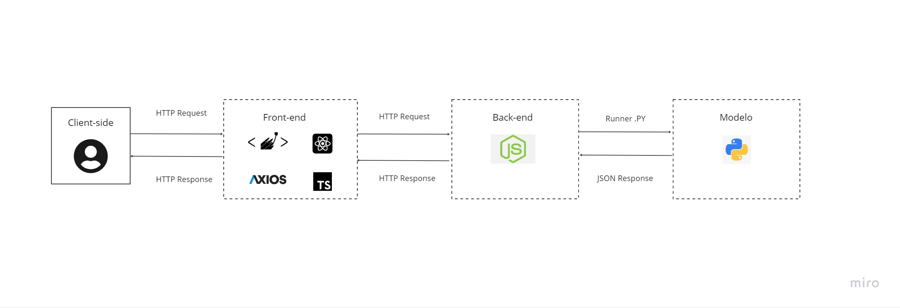

# **Titan Analytics - Challenge Inteli Blockchain 2023**

**Nome da solução:**

_Titan Analytics_

**Data de criação:**

06 de maio de 2023

# **Sumário**

# **Overview do Projeto**

## Árvore de arquivos (placeholder)

As pastas desse projeto foram organizadas conforme exemplo a seguir:

```
├── .vscode
├── Backend
│    ├── database
│    ├── hardhat
│    ├── prisma
│    ├── src
│    ├── utils
├── Documents
├── IA
│    ├── (arquivos da ia)
├── Frontend
│    ├── .next
│    ├── assets
│    ├── components
│    ├── pages
│    ├── public
│    ├── styles
├── README.md
```

## 1. Descrição da Solução

A _“Titan Analytics”_ é uma plataforma que utiliza inteligência artificial para fornecer informações precisas e atualizadas aos analistas da Titanium Asset Management e público interessado em crypto ativos, orientando suas decisões de investimento em criptomoedas. Por meio da coleta de dados de diversas fontes online, com a junção de análise dos mesmos em tempo real, o sistema gera relatórios detalhados e confiáveis que ajudam os usúarios a identificar oportunidades de investimento e tendências de mercado de forma ágil e embasada. Com essa solução, a _“Titan Analytics”_ tem à disposição um conjunto de informações valiosas para ajudar a tomar decisões de investimento mais assertivas.

---

## **Elaboração do Sistema**

## 2.1 Arquitetura do Sistema



## 2.2 Tecnologias Utilizadas

Tecnologias utilizadas no desenvolvimento da aplicação:

- React
- CSS
- Typescript
- Node Js
- Python
- Hardhat
- Solidity

## 2.3 Protótipo da solução

Primeiramente desenvolvemos o fluxo de uso da nossa solução prototipando nossas telas no figma.

### Landing Page

### Research HUB

É nela que disponibilizamos para nosso usuário as principais informações que ele necessita para uma avaliação do ativo


### Notícias Detalhadas

Ao clicar em determinada notícia no _Research Hub_, nosso usuário encontra essa **pagina**(?) com as informações detalhadas da notícia, um resumo, o sentimento geral, além de uma _nuvem de palavras_


## 2.4 Código Fonte {#2-4-código-fonte}

## 2.5 Implementações futuras

Nosso projeto não foi pensado exclusivamente para o hackathon, mas sim feito para o mercado, portanto, está pronto para receber novas implementações, como:

- (MINEIRINHO COLOCAR AQUELES DADOS DE MELHORIAS FUTURAS QUE EXPLIQUEI HOJE A TARDE)

# **3\. Rodando a aplicação**

## Licença (Placeholder)

Distributed under the MIT License. See `LICENSE` for more information.

## Colaboradores

<table><tbody><tr><td><a href="https://www.linkedin.com/in/allan-casado-6339a9177/"></a><br><a href="https://www.linkedin.com/in/allan-casado-6339a9177/"><strong><sub>Allan Casado</sub></strong><sub>&nbsp;</sub></a></td><td><a href="https://www.linkedin.com/in/eduardo-franca-porto/"></a><br><a href="https://www.linkedin.com/in/eduardo-franca-porto/"><strong><sub>Eduardo Porto</sub></strong><sub>&nbsp;</sub></a></td><td><a href="https://www.linkedin.com/in/felipe-saadi/"></a><br><a href="https://www.linkedin.com/in/felipe-saadi/"><strong><sub>Felipe Saadi</sub></strong><sub>&nbsp;</sub></a></td><td><a href="https://www.linkedin.com/in/joão-lucas-gonzalez/"></a><br><a href="https://www.linkedin.com/in/joão-lucas-gonzalez/"><strong><sub>João Lucas Gonzalez</sub></strong><sub>&nbsp;</sub></a></td><td><a href="https://www.linkedin.com/in/mihaellalves/"></a><br><a href="https://www.linkedin.com/in/mihaellalves/"><strong><sub>Mihaell Alves</sub></strong><sub>&nbsp;</sub></a></td><td><a href="https://www.linkedin.com/in/pedro-gattai-096678227/"></a><br><a href="https://www.linkedin.com/in/pedro-gattai-096678227/"><strong><sub>Pedro Gattai</sub></strong><sub>&nbsp;</sub></a></td></tr></tbody></table>
